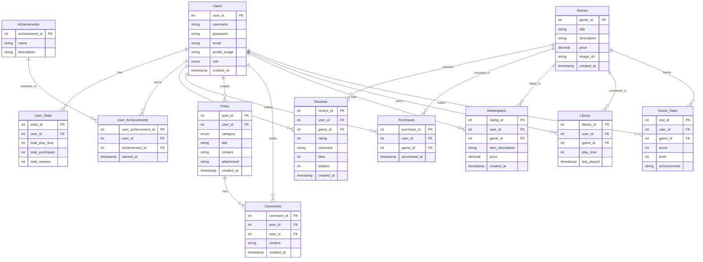

# 데이터베이스 설계

## 1. 회원가입/로그인

### **Table: Users**

| Column Name   | Data Type             | Constraints                 |
| ------------- | --------------------- | --------------------------- |
| user_id       | INT                   | PRIMARY KEY, AUTO_INCREMENT |
| username      | VARCHAR(50)           | UNIQUE, NOT NULL            |
| password      | VARCHAR(255)          | NOT NULL                    |
| email         | VARCHAR(100)          | UNIQUE, NOT NULL            |
| profile_image | VARCHAR(255)          | NULLABLE                    |
| role          | ENUM('USER', 'ADMIN') | DEFAULT 'USER', NOT NULL    |
| created_at    | TIMESTAMP             | DEFAULT CURRENT_TIMESTAMP   |

------

## 2. 개인 페이지

### **Table: User_Stats**

| Column Name     | Data Type | Constraints                 |
| --------------- | --------- | --------------------------- |
| stats_id        | INT       | PRIMARY KEY, AUTO_INCREMENT |
| user_id         | INT       | FOREIGN KEY (Users.user_id) |
| total_play_time | INT       | DEFAULT 0                   |
| total_purchases | INT       | DEFAULT 0                   |
| total_reviews   | INT       | DEFAULT 0                   |

### **Table: Achievements**

| Column Name    | Data Type    | Constraints                 |
| -------------- | ------------ | --------------------------- |
| achievement_id | INT          | PRIMARY KEY, AUTO_INCREMENT |
| name           | VARCHAR(100) | NOT NULL                    |
| description    | TEXT         | NOT NULL                    |

### **Table: User_Achievements**

| Column Name         | Data Type | Constraints                               |
| ------------------- | --------- | ----------------------------------------- |
| user_achievement_id | INT       | PRIMARY KEY, AUTO_INCREMENT               |
| user_id             | INT       | FOREIGN KEY (Users.user_id)               |
| achievement_id      | INT       | FOREIGN KEY (Achievements.achievement_id) |
| earned_at           | TIMESTAMP | DEFAULT CURRENT_TIMESTAMP                 |

------

## 3. 게임 상품

### **Table: Games**

| Column Name | Data Type      | Constraints                 |
| ----------- | -------------- | --------------------------- |
| game_id     | INT            | PRIMARY KEY, AUTO_INCREMENT |
| title       | VARCHAR(100)   | NOT NULL                    |
| description | TEXT           | NOT NULL                    |
| price       | DECIMAL(10, 2) | NOT NULL                    |
| image_url   | VARCHAR(255)   | NULLABLE                    |
| created_at  | TIMESTAMP      | DEFAULT CURRENT_TIMESTAMP   |

### **Table: Reviews**

| Column Name | Data Type | Constraints                    |
| ----------- | --------- | ------------------------------ |
| review_id   | INT       | PRIMARY KEY, AUTO_INCREMENT    |
| user_id     | INT       | FOREIGN KEY (Users.user_id)    |
| game_id     | INT       | FOREIGN KEY (Games.game_id)    |
| rating      | INT       | CHECK (rating BETWEEN 1 AND 5) |
| comment     | TEXT      | NULLABLE                       |
| likes       | INT       | DEFAULT 0                      |
| dislikes    | INT       | DEFAULT 0                      |
| created_at  | TIMESTAMP | DEFAULT CURRENT_TIMESTAMP      |

### **Table: Purchases**

| Column Name  | Data Type | Constraints                 |
| ------------ | --------- | --------------------------- |
| purchase_id  | INT       | PRIMARY KEY, AUTO_INCREMENT |
| user_id      | INT       | FOREIGN KEY (Users.user_id) |
| game_id      | INT       | FOREIGN KEY (Games.game_id) |
| purchased_at | TIMESTAMP | DEFAULT CURRENT_TIMESTAMP   |

------

## 4. 커뮤니티

### **Table: Posts**

| Column Name | Data Type                          | Constraints                 |
| ----------- | ---------------------------------- | --------------------------- |
| post_id     | INT                                | PRIMARY KEY, AUTO_INCREMENT |
| user_id     | INT                                | FOREIGN KEY (Users.user_id) |
| category    | ENUM('GUIDE', 'REVIEW', 'GENERAL') | NOT NULL                    |
| title       | VARCHAR(100)                       | NOT NULL                    |
| content     | TEXT                               | NOT NULL                    |
| attachment  | VARCHAR(255)                       | NULLABLE                    |
| created_at  | TIMESTAMP                          | DEFAULT CURRENT_TIMESTAMP   |

### **Table: Comments**

| Column Name | Data Type | Constraints                 |
| ----------- | --------- | --------------------------- |
| comment_id  | INT       | PRIMARY KEY, AUTO_INCREMENT |
| post_id     | INT       | FOREIGN KEY (Posts.post_id) |
| user_id     | INT       | FOREIGN KEY (Users.user_id) |
| content     | TEXT      | NOT NULL                    |
| created_at  | TIMESTAMP | DEFAULT CURRENT_TIMESTAMP   |

### **Table: Marketplace**

| Column Name      | Data Type      | Constraints                 |
| ---------------- | -------------- | --------------------------- |
| listing_id       | INT            | PRIMARY KEY, AUTO_INCREMENT |
| user_id          | INT            | FOREIGN KEY (Users.user_id) |
| game_id          | INT            | FOREIGN KEY (Games.game_id) |
| item_description | TEXT           | NOT NULL                    |
| price            | DECIMAL(10, 2) | NOT NULL                    |
| created_at       | TIMESTAMP      | DEFAULT CURRENT_TIMESTAMP   |

------

## 5. 게임 라이브러리

### **Table: Library**

| Column Name | Data Type | Constraints                 |
| ----------- | --------- | --------------------------- |
| library_id  | INT       | PRIMARY KEY, AUTO_INCREMENT |
| user_id     | INT       | FOREIGN KEY (Users.user_id) |
| game_id     | INT       | FOREIGN KEY (Games.game_id) |
| play_time   | INT       | DEFAULT 0                   |
| last_played | TIMESTAMP | DEFAULT CURRENT_TIMESTAMP   |

------

## 6. 게임

### **Table: Game_Stats**

| Column Name  | Data Type | Constraints                 |
| ------------ | --------- | --------------------------- |
| stat_id      | INT       | PRIMARY KEY, AUTO_INCREMENT |
| user_id      | INT       | FOREIGN KEY (Users.user_id) |
| game_id      | INT       | FOREIGN KEY (Games.game_id) |
| score        | INT       | DEFAULT 0                   |
| level        | INT       | DEFAULT 0                   |
| achievements | TEXT      | NULLABLE                    |

------

