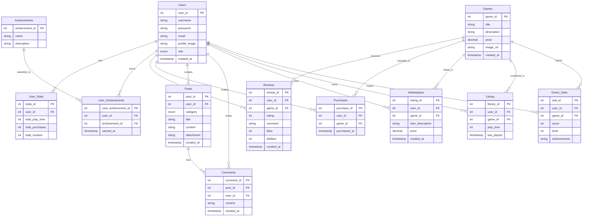

# 플랫폼 기능 및 구조 설명

## 1. 회원가입 및 로그인 시스템

회원은 플랫폼에 가입하고 로그인할 수 있음. 

주요 기능:
- **회원 정보 관리**: 사용자명, 비밀번호(암호화 저장), 이메일 등 기본 정보.
- **권한 분리**: 일반 사용자와 관리자로 역할 구분.
- **프로필 이미지 업로드**: 사용자 프로필을 꾸밀 수 있는 기능 제공.
- **소셜 로그인 지원**: 구글, 페이스북 등의 계정을 통한 간편 로그인.(OAuth 2.0 사용, Users 테이블에 소셜 로그인용 필드 추가)

## 2. 개인 페이지

사용자는 개인 페이지에서 자신의 활동을 확인하고 커스터마이징할 수 있음. 

주요 기능:
- **개인정보 확인 및 수정**: 사용자 이름, 이메일, 프로필 이미지 변경.
- **업적 관리**: 게임 플레이나 커뮤니티 활동을 통해 업적을 획득하고 확인.
- **통계 정보 제공**: 총 플레이 시간, 구매한 게임 수, 작성한 리뷰 수 등의 통계.
- **알림 기능**: 새로운 댓글, 업적 달성, 친구 요청 등 알림 제공.

## 3. 게임 상품 관리

플랫폼에서 제공하는 게임 상품에 대한 정보 및 사용자 리뷰를 관리. 

주요 기능:
- **게임 정보 제공**: 제목, 설명, 가격, 이미지 등의 상세 정보.
- **상품평 및 평점**: 사용자가 게임을 평가하고 댓글 작성.
- **추천 시스템**: 구매 이력과 리뷰를 기반으로 맞춤형 게임 추천.
- **할인 이벤트**: 특정 기간 동안 할인 정보 제공.
- **위시리스트**: 관심 있는 게임을 저장하는 기능.

## 4. 커뮤니티

사용자 간 소통과 정보 공유를 위한 공간을 제공. 

주요 기능:
- **게시글 작성 및 관리**: 가이드, 리뷰, 일반 게시글 등 다양한 카테고리 제공.
- **첨부파일 업로드**: 게시글에 스크린샷 등 첨부 가능.
- **댓글 및 답글**: 게시글에 대한 사용자 의견을 주고받을 수 있음.
- **신고 및 검토**: 부적절한 게시글이나 댓글 신고.
- **장터 시스템**: 사용자 간 게임 아이템 거래 지원.

## 5. 게임 라이브러리

사용자가 구매한 게임을 관리하고 플레이 기록을 확인할 수 있는 공간. 

주요 기능:
- **구매한 게임 목록**: 사용자가 보유한 게임을 한눈에 볼 수 있음.
- **플레이 시간 기록**: 각 게임의 총 플레이 시간 및 마지막 플레이 날짜 제공.
- **리뷰 작성 연결**: 라이브러리에서 바로 게임 리뷰 작성 가능.

## 6. 게임 플레이 정보

플랫폼에서 게임 플레이 데이터를 기록하고 분석. 

주요 기능:
- **멀티플레이 지원**: 친구와 매칭하거나 멀티플레이 방 생성.
- **성취도 트래킹**: 게임 내에서 달성한 점수나 목표 기록.
- **게임 업데이트 관리**: 구매한 게임의 업데이트 정보 제공.

## 7. 일반적인 플랫폼 요소

### UX/UI 개선
- **반응형 디자인**: PC, 모바일, 태블릿 등 다양한 기기에서 최적화된 화면 제공.
- **검색 및 필터 기능**: 게임, 게시글 등을 쉽게 찾을 수 있는 인터페이스.

### 보안
- **데이터 암호화**: 비밀번호는 해시 알고리즘을 사용해 안전하게 저장.
- **결제 보안**: 결제 관련 정보는 외부 결제 서비스(PG사)와 연동.(테스트 환경으로 결제 시나리오 테스트 진행)
- **권한 관리**: 사용자와 관리자의 접근 권한 분리.

### 확장성
- **다국어 지원**: 글로벌 사용자 확보를 위한 언어 선택 기능.
- **API 제공**: 모바일 앱이나 외부 서비스와 연동 가능.

### 로그 및 분석

- **사용자 행동 로그**: 인기 게임, 가장 많이 방문한 페이지 등의 데이터 분석.
- **관리자 대시보드**: 플랫폼의 주요 통계를 시각적으로 확인.

------

# 데이터베이스 설계

## 1. 회원가입/로그인

### **Table: Users**

| Column Name   | Data Type             | Constraints                 |
| ------------- | --------------------- | --------------------------- |
| user_id       | INT                   | PRIMARY KEY, AUTO_INCREMENT |
| username      | VARCHAR(50)           | UNIQUE, NOT NULL            |
| password      | VARCHAR(255)          | NOT NULL                    |
| email         | VARCHAR(100)          | UNIQUE, NOT NULL            |
| profile_image | VARCHAR(255)          | NULLABLE                    |
| role          | ENUM('USER', 'ADMIN') | DEFAULT 'USER', NOT NULL    |
| created_at    | TIMESTAMP             | DEFAULT CURRENT_TIMESTAMP   |

------

## 2. 개인 페이지

### **Table: User_Stats**

| Column Name     | Data Type | Constraints                 |
| --------------- | --------- | --------------------------- |
| stats_id        | INT       | PRIMARY KEY, AUTO_INCREMENT |
| user_id         | INT       | FOREIGN KEY (Users.user_id) |
| total_play_time | INT       | DEFAULT 0                   |
| total_purchases | INT       | DEFAULT 0                   |
| total_reviews   | INT       | DEFAULT 0                   |

### **Table: Achievements**

| Column Name    | Data Type    | Constraints                 |
| -------------- | ------------ | --------------------------- |
| achievement_id | INT          | PRIMARY KEY, AUTO_INCREMENT |
| name           | VARCHAR(100) | NOT NULL                    |
| description    | TEXT         | NOT NULL                    |

### **Table: User_Achievements**

| Column Name         | Data Type | Constraints                               |
| ------------------- | --------- | ----------------------------------------- |
| user_achievement_id | INT       | PRIMARY KEY, AUTO_INCREMENT               |
| user_id             | INT       | FOREIGN KEY (Users.user_id)               |
| achievement_id      | INT       | FOREIGN KEY (Achievements.achievement_id) |
| earned_at           | TIMESTAMP | DEFAULT CURRENT_TIMESTAMP                 |

------

## 3. 게임 상품

### **Table: Games**

| Column Name | Data Type      | Constraints                 |
| ----------- | -------------- | --------------------------- |
| game_id     | INT            | PRIMARY KEY, AUTO_INCREMENT |
| title       | VARCHAR(100)   | NOT NULL                    |
| description | TEXT           | NOT NULL                    |
| price       | DECIMAL(10, 2) | NOT NULL                    |
| image_url   | VARCHAR(255)   | NULLABLE                    |
| created_at  | TIMESTAMP      | DEFAULT CURRENT_TIMESTAMP   |

### **Table: Reviews**

| Column Name | Data Type | Constraints                    |
| ----------- | --------- | ------------------------------ |
| review_id   | INT       | PRIMARY KEY, AUTO_INCREMENT    |
| user_id     | INT       | FOREIGN KEY (Users.user_id)    |
| game_id     | INT       | FOREIGN KEY (Games.game_id)    |
| rating      | INT       | CHECK (rating BETWEEN 1 AND 5) |
| comment     | TEXT      | NULLABLE                       |
| likes       | INT       | DEFAULT 0                      |
| dislikes    | INT       | DEFAULT 0                      |
| created_at  | TIMESTAMP | DEFAULT CURRENT_TIMESTAMP      |

### **Table: Purchases**

| Column Name  | Data Type | Constraints                 |
| ------------ | --------- | --------------------------- |
| purchase_id  | INT       | PRIMARY KEY, AUTO_INCREMENT |
| user_id      | INT       | FOREIGN KEY (Users.user_id) |
| game_id      | INT       | FOREIGN KEY (Games.game_id) |
| purchased_at | TIMESTAMP | DEFAULT CURRENT_TIMESTAMP   |

------

## 4. 커뮤니티

### **Table: Posts**

| Column Name | Data Type                          | Constraints                 |
| ----------- | ---------------------------------- | --------------------------- |
| post_id     | INT                                | PRIMARY KEY, AUTO_INCREMENT |
| user_id     | INT                                | FOREIGN KEY (Users.user_id) |
| category    | ENUM('GUIDE', 'REVIEW', 'GENERAL') | NOT NULL                    |
| title       | VARCHAR(100)                       | NOT NULL                    |
| content     | TEXT                               | NOT NULL                    |
| attachment  | VARCHAR(255)                       | NULLABLE                    |
| created_at  | TIMESTAMP                          | DEFAULT CURRENT_TIMESTAMP   |

### **Table: Comments**

| Column Name | Data Type | Constraints                 |
| ----------- | --------- | --------------------------- |
| comment_id  | INT       | PRIMARY KEY, AUTO_INCREMENT |
| post_id     | INT       | FOREIGN KEY (Posts.post_id) |
| user_id     | INT       | FOREIGN KEY (Users.user_id) |
| content     | TEXT      | NOT NULL                    |
| created_at  | TIMESTAMP | DEFAULT CURRENT_TIMESTAMP   |

### **Table: Marketplace**

| Column Name      | Data Type      | Constraints                 |
| ---------------- | -------------- | --------------------------- |
| listing_id       | INT            | PRIMARY KEY, AUTO_INCREMENT |
| user_id          | INT            | FOREIGN KEY (Users.user_id) |
| game_id          | INT            | FOREIGN KEY (Games.game_id) |
| item_description | TEXT           | NOT NULL                    |
| price            | DECIMAL(10, 2) | NOT NULL                    |
| created_at       | TIMESTAMP      | DEFAULT CURRENT_TIMESTAMP   |

------

## 5. 게임 라이브러리

### **Table: Library**

| Column Name | Data Type | Constraints                 |
| ----------- | --------- | --------------------------- |
| library_id  | INT       | PRIMARY KEY, AUTO_INCREMENT |
| user_id     | INT       | FOREIGN KEY (Users.user_id) |
| game_id     | INT       | FOREIGN KEY (Games.game_id) |
| play_time   | INT       | DEFAULT 0                   |
| last_played | TIMESTAMP | DEFAULT CURRENT_TIMESTAMP   |

------

## 6. 게임

### **Table: Game_Stats**

| Column Name  | Data Type | Constraints                 |
| ------------ | --------- | --------------------------- |
| stat_id      | INT       | PRIMARY KEY, AUTO_INCREMENT |
| user_id      | INT       | FOREIGN KEY (Users.user_id) |
| game_id      | INT       | FOREIGN KEY (Games.game_id) |
| score        | INT       | DEFAULT 0                   |
| level        | INT       | DEFAULT 0                   |
| achievements | TEXT      | NULLABLE                    |

------

