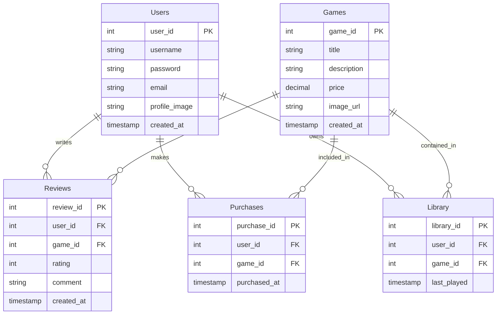

```mermaid

erDiagram
    Users ||--o{ Reviews : writes
    Users ||--o{ Purchases : makes
    Users ||--o{ Library : owns
    
    Games ||--o{ Reviews : receives
    Games ||--o{ Purchases : included_in
    Games ||--o{ Library : contained_in
    
    Reviews {
        int review_id PK
        int user_id FK
        int game_id FK
        int rating
        string comment
        timestamp created_at
    }
    
    Purchases {
        int purchase_id PK
        int user_id FK
        int game_id FK
        timestamp purchased_at
    }
    
    Library {
        int library_id PK
        int user_id FK
        int game_id FK
        timestamp last_played
    }
    
    Users {
        int user_id PK
        string username
        string password
        string email
        string profile_image
        timestamp created_at
    }
    
    Games {
        int game_id PK
        string title
        string description
        decimal price
        string image_url
        timestamp created_at
    }

```