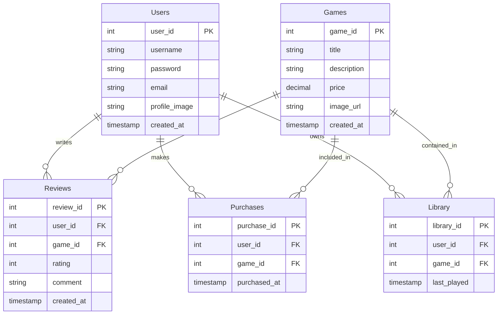

### **1. JSP용 DB 설계**

#### **ERD 개요**



#### **테이블 설계**

1. **Users 테이블**

   - 사용자 정보를 저장.

   ```sql
    CREATE TABLE Users (
       user_id INT AUTO_INCREMENT PRIMARY KEY,
       username VARCHAR(50) NOT NULL UNIQUE,
       password VARCHAR(255) NOT NULL,
       email VARCHAR(100) NOT NULL UNIQUE,
       profile_image VARCHAR(255),
       created_at TIMESTAMP DEFAULT CURRENT_TIMESTAMP
   );
   ```

2. **Games 테이블**

   - 게임 상품 정보를 저장.

   ```sql
    CREATE TABLE Games (
       game_id INT AUTO_INCREMENT PRIMARY KEY,
       title VARCHAR(100) NOT NULL,
       description TEXT,
       price DECIMAL(10, 2) NOT NULL,
       image_url VARCHAR(255),
       created_at TIMESTAMP DEFAULT CURRENT_TIMESTAMP
   );
   ```

3. **Reviews 테이블**

   - 게임 리뷰를 저장.

   ```sql
    CREATE TABLE Reviews (
       review_id INT AUTO_INCREMENT PRIMARY KEY,
       user_id INT NOT NULL,
       game_id INT NOT NULL,
       rating INT CHECK (rating BETWEEN 1 AND 5),
       comment TEXT,
       created_at TIMESTAMP DEFAULT CURRENT_TIMESTAMP,
       FOREIGN KEY (user_id) REFERENCES Users(user_id),
       FOREIGN KEY (game_id) REFERENCES Games(game_id)
   );
   ```

4. **Purchases 테이블**

   - 구매 기록을 저장.

   ```sql
    CREATE TABLE Purchases (
       purchase_id INT AUTO_INCREMENT PRIMARY KEY,
       user_id INT NOT NULL,
       game_id INT NOT NULL,
       purchased_at TIMESTAMP DEFAULT CURRENT_TIMESTAMP,
       FOREIGN KEY (user_id) REFERENCES Users(user_id),
       FOREIGN KEY (game_id) REFERENCES Games(game_id)
   );
   ```

5. **Library 테이블**

   - 사용자가 소유한 게임 정보를 저장.

   ```sql
    CREATE TABLE Library (
       library_id INT AUTO_INCREMENT PRIMARY KEY,
       user_id INT NOT NULL,
       game_id INT NOT NULL,
       last_played TIMESTAMP DEFAULT CURRENT_TIMESTAMP,
       FOREIGN KEY (user_id) REFERENCES Users(user_id),
       FOREIGN KEY (game_id) REFERENCES Games(game_id)
   );
   ```

------

### **2. JSP 프로젝트 폴더 구조**

```plaintext
project-name/
├── src/
│   ├── main/
│   │   ├── java/
│   │   │   ├── com.projectname.controller/   # 컨트롤러 서블릿
│   │   │   ├── com.projectname.dao/          # DAO 클래스
│   │   │   ├── com.projectname.model/        # VO 클래스
│   │   │   └── com.projectname.util/         # DB 연결 유틸리티
│   │   └── webapp/
│   │       ├── WEB-INF/
│   │       │   ├── views/                    # JSP 뷰 파일
│   │       │   └── web.xml                   # 서블릿 설정
│   │       ├── resources/                    # CSS/JS/이미지
│   │       │   ├── css/
│   │       │   ├── js/
│   │       │   └── images/
│   │       └── META-INF/
│   └── test/                                 # 테스트 관련
```

------

### **3. 작업 순서**

1. **DB 설계 및 테이블 생성**
   - 위의 SQL을 사용하여 DB 테이블을 생성.
2. **DB 연결 유틸리티 작성**
   - `DBConnectionUtil` 클래스를 작성하여 DB 연결을 관리.
3. **DAO 클래스 작성**
   - `UsersDAO`, `GamesDAO`, `ReviewsDAO` 등을 작성하여 데이터베이스와의 상호작용을 처리.
4. **JSP 페이지 설계**
   - 회원가입, 로그인, 상품 목록, 상세 페이지, 리뷰 페이지, 구매 페이지 등을 JSP로 작성.
5. **컨트롤러 서블릿 작성**
   - 각 기능별로 서블릿을 작성하여 요청을 처리하고 JSP로 데이터를 전달.

------

### **4. DB 연결 방식**

#### **DBConnectionUtil 클래스**

- JSP 단계에서는 간단한 DB 연결 유틸리티를 작성.
- JNDI 설정 대신, 직접 DB 연결을 처리하여 간소화.

```java
package com.projectname.util;

import java.sql.Connection;
import java.sql.DriverManager;
import java.sql.SQLException;

public class DBConnectionUtil {
    private static final String URL = "jdbc:mysql://localhost:3306/your_db";
    private static final String USER = "root";
    private static final String PASSWORD = "password";

    public static Connection getConnection() throws SQLException {
        try {
            Class.forName("com.mysql.cj.jdbc.Driver");
        } catch (ClassNotFoundException e) {
            e.printStackTrace();
        }
        return DriverManager.getConnection(URL, USER, PASSWORD);
    }
}
```

#### **DB 연결 사용 예시**

```java
Connection con = null;
try {
    con = DBConnectionUtil.getConnection();
    // 작업 수행
} catch (SQLException e) {
    e.printStackTrace();
} finally {
    if (con != null) con.close();
}
```

------

