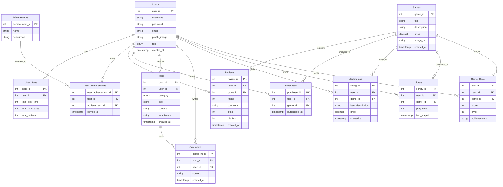

# Game Juke Box

### **프로젝트 개요**

Game Juke Box는 다양한 게임을 즐기고, 구매하고, 커뮤니티 활동까지 가능한 통합 플랫폼. 
사용자는 간단한 고전 게임을 즐기면서, 게임 상품을 구매하고, 리뷰를 작성하며 커뮤니티 활동에 참여할 수 있음.

### **데모 및 배포**

- **현재 데모 URL**: 없음 (향후 Replit 또는 Heroku에 배포 예정)
- **기능 시연 자료**: youtube 영상 및 스크린샷 첨부 예정

### **설치 및 실행 방법**

#### **개발 환경**

- **OS**: Windows 기반
- **IDE**:
  - JSP 개발: Eclipse
  - Spring 및 React 개발: IntelliJ IDEA
- **Database**: Oracle DB XE, MySQL
- **JDK**: Version 17

#### **실행 방법**

1. 프로젝트 클론 (현재 준비 중)
2. 의존성 설치 및 실행 방법은 작업 후 제공 예정

### **기술 스택**

#### **백엔드**

- JSP (프로토타입 구현)
- Spring Boot (최종 확장)

#### **프론트엔드**

- HTML, CSS, JavaScript (프로토타입)
- React (최종 구현)

#### **데이터베이스**

- Oracle DB XE
- MySQL

### **주요 기능**

1. **회원가입/로그인**: 기본 인증 및 소셜 로그인 (OAuth 2.0)
2. **게임 상품 관리**: CRUD, 리뷰 및 평점 기능 포함
3. **미니게임**: 간단한 고전 게임과 점수 저장 시스템
4. **커뮤니티**: 게시글 및 댓글 작성 기능
5. **사용자 라이브러리**: 구매 게임 관리 및 플레이 기록 저장

### **데이터베이스 구조**

#### **ERD (초기 설계)**

#### **주요 테이블 설명**

- **Users**: 사용자 정보 (아이디, 이메일, 비밀번호 등)
- **Games**: 게임 정보 (제목, 설명, 가격 등)
- **Reviews**: 사용자 리뷰 (평점, 코멘트 등)
- **Library**: 사용자가 보유한 게임 및 플레이 시간 기록

### **작업 흐름 및 워크플로우**

#### **1. JSP 프로토타입 제작**

1. **환경 설정 및 초기화**: Tomcat과 MySQL 설정, DB 스키마 생성.
2. **기능 개발**: 회원가입/로그인, 상품 관리, 커뮤니티 기능 구현.
3. **미니게임 추가**: JavaScript로 간단한 게임 구현 및 연동.

#### **2. Spring 기반 확장**

1. **Spring Boot로 전환**: 기존 JSP 기능을 Spring으로 리팩터링.
2. **RESTful API 설계**: 데이터 통신을 위한 API 구현.

#### **3. React 프론트엔드 통합**

1. **React 프로젝트 생성 및 연동**.
2. **UI/UX 개선 및 고전 게임 React 통합**.

#### **4. 최종 배포 및 발표 준비**

1. 최종 테스트 및 디버깅.
2. 배포 및 시연 자료 준비.

### **향후 확장 계획**

1. 추가 고전 게임 개발 (테트리스, 플래피 버드 등).
2. 결제 시스템 연동 (PG사 API 테스트 환경 사용).
3. 글로벌 사용자 지원을 위한 다국어 기능 추가.
